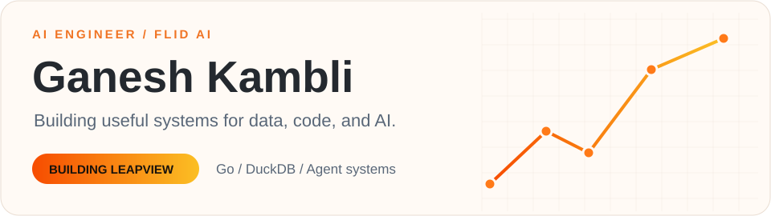
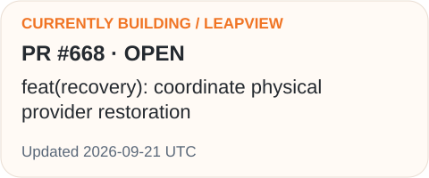
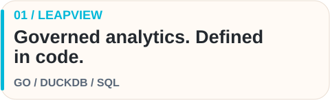
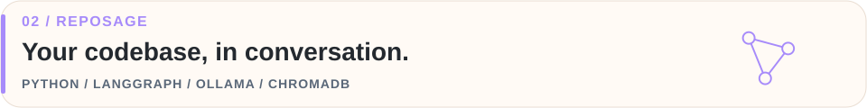
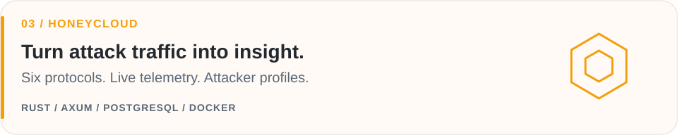
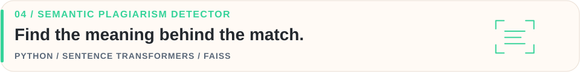

<!-- ═══════════════════════════════════════════════════════════
     HEADER
══════════════════════════════════════════════════════════════ -->

  <!-- Theme-aware hero -->
  <picture>
    <source media="(max-width: 600px) and (prefers-color-scheme: dark)" srcset="assets/banner-dark-mobile.svg" />
    <source media="(max-width: 600px)" srcset="assets/banner-light-mobile.svg" />
    <source media="(prefers-color-scheme: dark)" srcset="assets/banner-dark.svg" />
    <source media="(prefers-color-scheme: light)" srcset="assets/banner-light.svg" />
    
  </picture>

  <!-- Quick badges row -->
  

    
    &nbsp;
    
    &nbsp;
    
  

  <!-- Animated terminal, with a reduced-motion fallback -->
  <picture>
    <source media="(max-width: 600px) and (prefers-color-scheme: dark)" srcset="assets/terminal-dark-mobile.svg" />
    <source media="(max-width: 600px)" srcset="assets/terminal-light-mobile.svg" />
    <source media="(prefers-color-scheme: dark)" srcset="assets/terminal-dark.svg" />
    <source media="(prefers-color-scheme: light)" srcset="assets/terminal-light.svg" />
    
  </picture>

<a href="https://github.com/flidai/leapview">LeapView</a> · <a href="https://github.com/Ganesh-403/Repo-Sage">RepoSage</a> · <a href="https://github.com/Ganesh-403/honeycloud">HoneyCloud</a> · <a href="https://portfolio-website-ganesh-kamblis-projects.vercel.app/">Portfolio</a>

 

<!-- ═══════════════════════════════════════════════════════════
     ABOUT ME / IDENTITY
══════════════════════════════════════════════════════════════ -->

  

 

### 🧠 Turning data, code, and signals into useful tools.

I'm **Ganesh**, an **AI Engineer at Flid AI**, building **[LeapView](https://github.com/flidai/leapview)** — open-source BI powered by **Go** and **DuckDB**. My work connects governed analytics, backend infrastructure, and AI agents.

- 🚀 **At LeapView**: Semantic models and dashboards defined as code, reviewed in Git, and explored through dashboards and AI agents.
- ⚡ **Engineering focus**: Go backends, DuckDB query execution, semantic data models, and context retrieval for agents.
- 🔬 **Research & Publications**: Published **2 research papers** on distributed honeypot architectures and machine learning-driven threat classification.
- 🛠️ **Open Source & Community**: Project Admin & Maintainer for **ECSoC'26** and open-source contributor (**GSSoC'26**).

<a href="https://github.com/flidai/leapview/pulls?q=is%3Apr+author%3AGanesh-403+sort%3Aupdated-desc">
  <picture>
    <source media="(max-width: 600px) and (prefers-color-scheme: dark)" srcset="assets/currently-building-dark-mobile.svg" />
    <source media="(max-width: 600px)" srcset="assets/currently-building-light-mobile.svg" />
    <source media="(prefers-color-scheme: dark)" srcset="assets/currently-building-dark.svg" />
    <source media="(prefers-color-scheme: light)" srcset="assets/currently-building-light.svg" />
    
  </picture>
</a>

 

<!-- ═══════════════════════════════════════════════════════════
     FEATURED WORK
══════════════════════════════════════════════════════════════ -->

  

 

<a href="https://github.com/flidai/leapview">
  <picture>
    <source media="(max-width: 600px) and (prefers-color-scheme: dark)" srcset="assets/leapview-dark-mobile.svg" />
    <source media="(max-width: 600px)" srcset="assets/leapview-light-mobile.svg" />
    <source media="(prefers-color-scheme: dark)" srcset="assets/leapview-dark.svg" />
    <source media="(prefers-color-scheme: light)" srcset="assets/leapview-light.svg" />
    
  </picture>
</a>

<a href="https://github.com/Ganesh-403/Repo-Sage">
  <picture>
    <source media="(max-width: 600px) and (prefers-color-scheme: dark)" srcset="assets/reposage-dark-mobile.svg" />
    <source media="(max-width: 600px)" srcset="assets/reposage-light-mobile.svg" />
    <source media="(prefers-color-scheme: dark)" srcset="assets/reposage-dark.svg" />
    <source media="(prefers-color-scheme: light)" srcset="assets/reposage-light.svg" />
    
  </picture>
</a>

<a href="https://github.com/Ganesh-403/honeycloud">
  <picture>
    <source media="(max-width: 600px) and (prefers-color-scheme: dark)" srcset="assets/honeycloud-dark-mobile.svg" />
    <source media="(max-width: 600px)" srcset="assets/honeycloud-light-mobile.svg" />
    <source media="(prefers-color-scheme: dark)" srcset="assets/honeycloud-dark.svg" />
    <source media="(prefers-color-scheme: light)" srcset="assets/honeycloud-light.svg" />
    
  </picture>
</a>

<a href="https://github.com/Ganesh-403/semantic-plagiarism-detector">
  <picture>
    <source media="(max-width: 600px) and (prefers-color-scheme: dark)" srcset="assets/plagiarism-dark-mobile.svg" />
    <source media="(max-width: 600px)" srcset="assets/plagiarism-light-mobile.svg" />
    <source media="(prefers-color-scheme: dark)" srcset="assets/plagiarism-dark.svg" />
    <source media="(prefers-color-scheme: light)" srcset="assets/plagiarism-light.svg" />
    
  </picture>
</a>

<a href="https://semantic-plagiarism-detector.streamlit.app/">Try the plagiarism detector ↗</a>

 

<!-- ═══════════════════════════════════════════════════════════
     TECH STACK
══════════════════════════════════════════════════════════════ -->

  

<table>
  <tr>
    <th>Domain</th>
    <th>Technologies &amp; Tools</th>
  </tr>
  <tr>
    <td><strong>Languages &amp; Core</strong></td>
    <td>
      
      
      
      
      
      
    </td>
  </tr>
  <tr>
    <td><strong>AI &amp; Agent Systems</strong></td>
    <td>
      
      
      
      
      
       
      
      
      
      
    </td>
  </tr>
  <tr>
    <td><strong>Data &amp; Backend Infrastructure</strong></td>
    <td>
      
      
      
      
      
      
      
      
    </td>
  </tr>
  <tr>
    <td><strong>Cloud &amp; DevOps</strong></td>
    <td>
      
      
      
      
      
      
    </td>
  </tr>
</table>

 

<!-- ═══════════════════════════════════════════════════════════
     PUBLICATIONS & ACHIEVEMENTS
══════════════════════════════════════════════════════════════ -->

  

<table>
  <tr>
    <td align="center">📄</td>
    <td><strong>2 Published Research Papers</strong> — Distributed honeypot architecture & AI-driven threat classification</td>
  </tr>
  <tr>
    <td align="center">🛠️</td>
    <td><strong>Project Admin & Maintainer</strong> — Elite Coders Summer of Code (ECSoC'26)</td>
  </tr>
  <tr>
    <td align="center">🌱</td>
    <td><strong>Open Source Contributor</strong> — GirlScript Summer of Code (GSSoC'26)</td>
  </tr>
  <tr>
    <td align="center">🥇</td>
    <td><strong>Winner</strong> — Site Craft Web Development Challenge (VAMINT Club 2025)</td>
  </tr>
  <tr>
    <td align="center">🏆</td>
    <td><strong>Runner-Up</strong> — Prep-A-Thon Coding Competition (Technobash 2025)</td>
  </tr>
</table>

 

<!-- ═══════════════════════════════════════════════════════════
     GITHUB STATS
══════════════════════════════════════════════════════════════ -->

  

  
    
  <picture>
    <source media="(prefers-color-scheme: dark)" srcset="assets/snake-dark.svg" />
    <source media="(prefers-color-scheme: light)" srcset="assets/snake-light.svg" />
    
  </picture>

    

  <h3>⚡ Recent Activity</h3>

<!--START_SECTION:activity-->
1. 💪 Opened PR [#529](https://github.com/flidai/leapview/pull/529) in [flidai/leapview](https://github.com/flidai/leapview)
2. 🎉 Merged PR [#519](https://github.com/flidai/leapview/pull/519) in [flidai/leapview](https://github.com/flidai/leapview)
3. 🎉 Merged PR [#523](https://github.com/flidai/leapview/pull/523) in [flidai/leapview](https://github.com/flidai/leapview)
4. 🎉 Merged PR [#522](https://github.com/flidai/leapview/pull/522) in [flidai/leapview](https://github.com/flidai/leapview)
5. 🗣 Commented on [#523](https://github.com/flidai/leapview/pull/523#issuecomment-5572270650) in [flidai/leapview](https://github.com/flidai/leapview)
<!--END_SECTION:activity-->

 

<!-- ═══════════════════════════════════════════════════════════
     CONNECT
══════════════════════════════════════════════════════════════ -->

  

  Always excited to collaborate on <strong>Agent-Native Systems</strong>, <strong>Golang infrastructure</strong>, and <strong>Analytics as Code</strong>.

  
  &nbsp;
  
  &nbsp;
  

  

<!-- Footer -->

  

