 

<a href="https://portfolio-website-ganesh-kamblis-projects.vercel.app/">Portfolio ↗</a> &nbsp; · &nbsp;
<a href="https://www.linkedin.com/in/ganeshkambli/">LinkedIn ↗</a> &nbsp; · &nbsp;
<a href="mailto:gkambli70@gmail.com">Say hello ↗</a>

## 🪐 A little about my orbit

I'm **Ganesh**, an **AI Engineer at [Flid AI](https://flid.ai/)** in Mumbai, India. I'm building **[LeapView](https://github.com/flidai/leapview)** — open-source BI powered by **Go and DuckDB**.

My work connects **governed analytics, backend infrastructure, and AI agents**: semantic models and dashboards defined as code, reviewed in Git, and explored through dashboards and agents.

- 🧠 **Current focus:** Go backends, DuckDB query execution, semantic data models, and context retrieval for agents.
- ⚡ **Core tools:** Go, DuckDB, and Python.
- 🛠️ **Things I build:** agent-native analytics, local code intelligence, honeypot infrastructure, and NLP tools.
- 🔬 **Research:** 2 published papers on distributed honeypot architectures and machine learning-driven threat classification.
- 🌱 **Community:** Project Admin & Maintainer for **ECSoC'26** and open-source contributor at **GSSoC'26**.
- 🏆 **Achievements:** Winner, Site Craft Web Development Challenge (VAMINT Club 2025); runner-up, Prep-A-Thon Coding Competition (Technobash 2025).

 

## ✨ Selected builds

A few corners of my work — from agent-native analytics and code intelligence to security and cloud infrastructure.

<table>
<tr>
<td width="50%" valign="top">
<h3>🚀 LeapView</h3>

Open-source BI at Flid AI: governed semantic models, dashboards as code, and analytics for AI agents.

<code>Go</code> <code>DuckDB</code> <code>AI agents</code>

<a href="https://github.com/flidai/leapview"><b>Explore the project →</b></a>
</td>
<td width="50%" valign="top">
<h3>🧠 RepoSage</h3>

Local codebase intelligence with GraphRAG, AST-based context, and answers grounded in source files.

<code>LangGraph</code> <code>Ollama</code> <code>ChromaDB</code>

<a href="https://github.com/Ganesh-403/Repo-Sage"><b>Explore the project →</b></a>
</td>
</tr>
<tr>
<td width="50%" valign="top">
<h3>🍯 HoneyCloud</h3>

Multi-protocol honeypot infrastructure with live attack telemetry, threat scoring, and attacker profiling.

<code>Rust</code> <code>Axum</code> <code>PostgreSQL</code>

<a href="https://github.com/Ganesh-403/honeycloud"><b>Explore the project →</b></a>
</td>
<td width="50%" valign="top">
<h3>🔍 Semantic Plagiarism Detector</h3>

Detecting paraphrased and cross-lingual text similarity with multilingual embeddings and vector search.

<code>Python</code> <code>SentenceTransformers</code> <code>FAISS</code>

<a href="https://github.com/Ganesh-403/semantic-plagiarism-detector"><b>Explore the project →</b></a>
</td>
</tr>
<tr>
<td width="50%" valign="top">
<h3>☁️ AWS URL Shortener</h3>

Serverless URL shortening with Lambda, API Gateway, DynamoDB, S3, and CloudFront.

<code>AWS</code> <code>Lambda</code> <code>DynamoDB</code>

<a href="https://github.com/Ganesh-403/aws-url-shortener"><b>Explore the project →</b></a>
</td>
<td width="50%" valign="top">
<h3>⚡ GPU Huffman</h3>

CUDA-accelerated character-frequency counting, Huffman code generation, and CPU/GPU benchmarks.

<code>C++</code> <code>CUDA</code> <code>Huffman coding</code>

<a href="https://github.com/Ganesh-403/GPU-huffman"><b>Explore the project →</b></a>
</td>
</tr>
</table>

<a href="https://github.com/Ganesh-403?tab=repositories"><b>More experiments, tools, and builds ↗</b></a>

## 🎨 My toolbox

<b>At the center of my work</b>

<b>Backend &amp; data</b>

<b>Cloud &amp; delivery</b>

<b>Also in the toolkit: AI, frontend &amp; languages</b>

 

<code>LangGraph</code> <code>LangChain</code> <code>RAG / GraphRAG</code> <code>MCP</code> <code>ChromaDB</code> <code>Qdrant</code> <code>FAISS</code> <code>PyTorch</code> <code>SQL</code>

## 🐍 A year of building, one square at a time

<picture>
  <source media="(prefers-color-scheme: dark)" srcset="./assets/snake-dark.svg" />
  <source media="(prefers-color-scheme: light)" srcset="./assets/snake-light.svg" />
  
</picture>

My contribution calendar, with a little personality. Refreshed daily.

<b>📊 More from my GitHub</b>

 

<a href="https://github.com/Ganesh-403?tab=repositories">Browse my repositories</a> · <a href="https://github.com/Ganesh-403?tab=stars">Things I find interesting</a>

<b>⚡ Recent public activity</b>

 

<!--START_SECTION:activity-->
1. 🎉 Merged PR [#581](https://github.com/flidai/leapview/pull/581) in [flidai/leapview](https://github.com/flidai/leapview)
2. 🗣 Commented on [#581](https://github.com/flidai/leapview/pull/581#issuecomment-5646291379) in [flidai/leapview](https://github.com/flidai/leapview)
3. 💪 Opened PR [#584](https://github.com/flidai/leapview/pull/584) in [flidai/leapview](https://github.com/flidai/leapview)
4. 🎉 Merged PR [#578](https://github.com/flidai/leapview/pull/578) in [flidai/leapview](https://github.com/flidai/leapview)
5. 💪 Opened PR [#581](https://github.com/flidai/leapview/pull/581) in [flidai/leapview](https://github.com/flidai/leapview)
<!--END_SECTION:activity-->

## 💬 Let's build something useful

I'm interested in collaborating on **agent-native systems, Golang infrastructure, analytics as code, and open source**. If you're working on a problem in that space, I'd love to hear about it.

